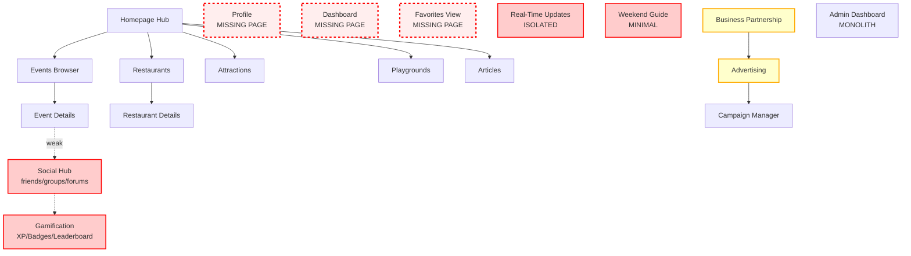
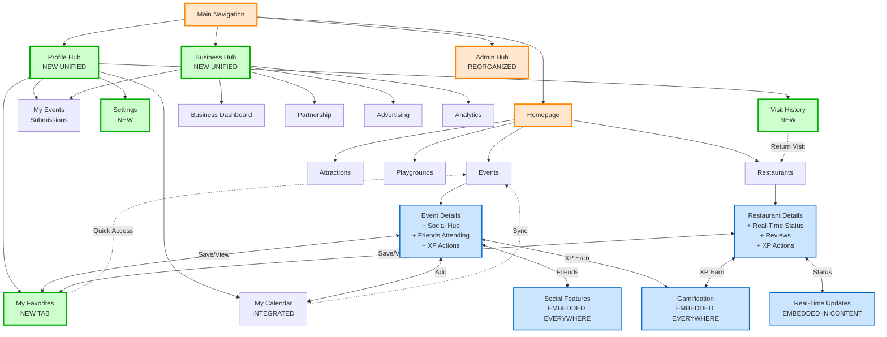
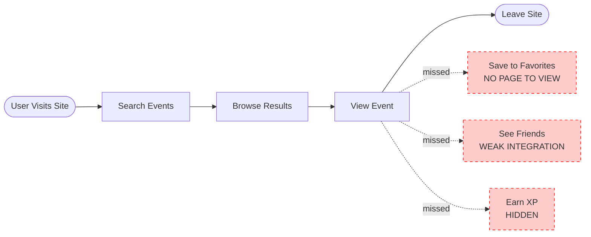
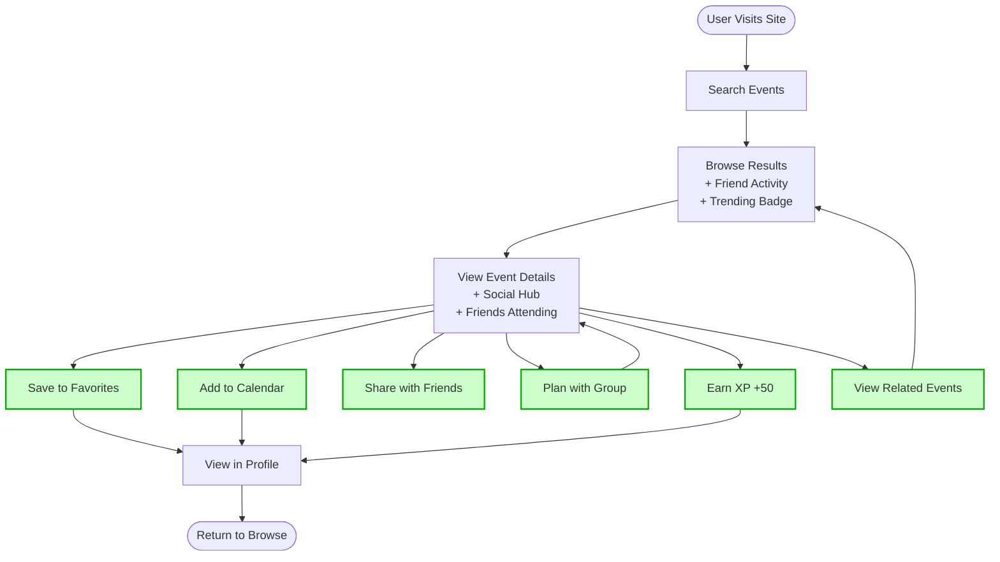
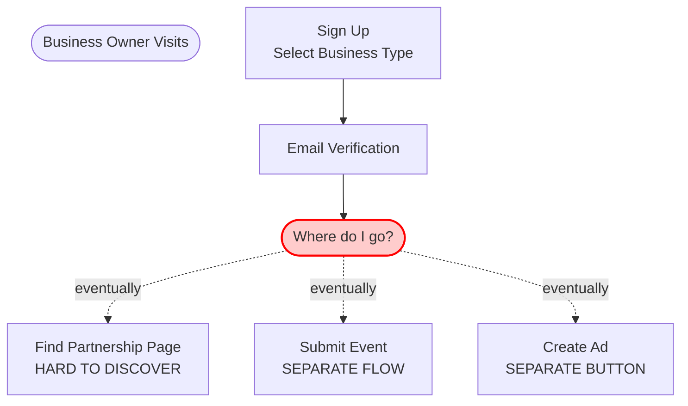
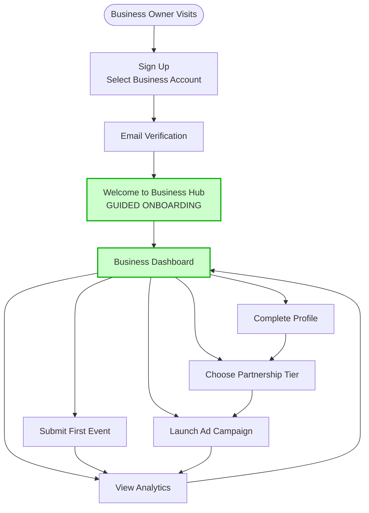
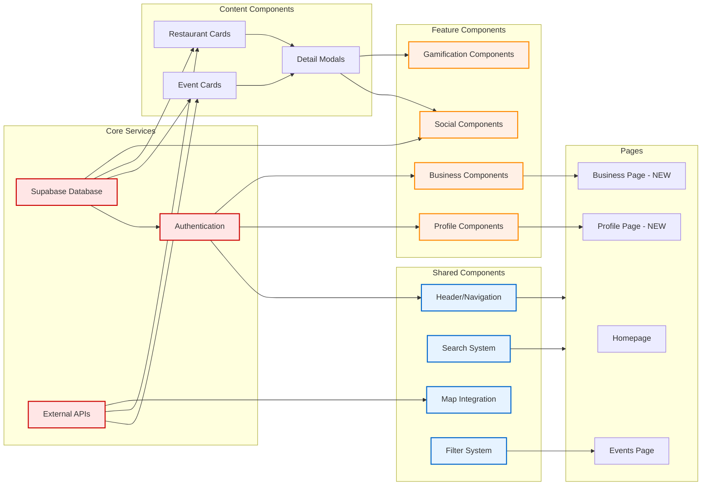
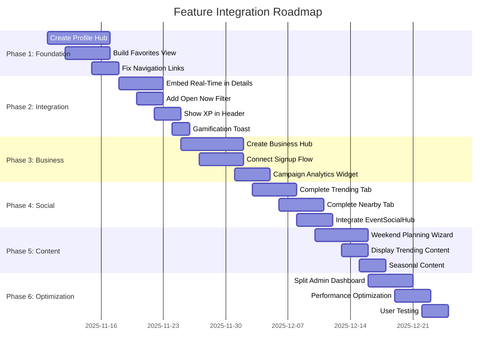

# Feature Relationship Diagrams

This document contains Mermaid diagrams showing how features connect in Des Moines AI Pulse.

---

## Current State: Disconnected Features



---

## Recommended State: Interconnected Ecosystem



---

## User Journey: Event Discovery (Current vs. Recommended)

### Current Flow (Limited Connections)



### Recommended Flow (Rich Connections)



---

## Business User Journey (Current vs. Recommended)

### Current Flow (Confusing Path)



### Recommended Flow (Clear Onboarding)



---

## Feature Integration Layers

```mermaid
graph TD
    subgraph Navigation Layer
        Nav[Main Navigation<br/>Events | Restaurants | Attractions]
    end

    subgraph Content Layer
        Events[Events Browser]
        Restaurants[Restaurant Directory]
        Details[Detail Pages]
    end

    subgraph Engagement Layer
        Social[Social<br/>Friends/Groups]
        Gamify[Gamification<br/>XP/Badges]
        RealTime[Real-Time<br/>Status Updates]
        AI[AI Recommendations]
    end

    subgraph Personal Layer
        Profile[Profile Hub]
        Favorites[Favorites]
        Calendar[Calendar]
        History[History]
    end

    subgraph Business Layer
        BizHub[Business Hub]
        Partnership[Partnership]
        Advertising[Advertising]
        Analytics[Analytics]
    end

    subgraph Admin Layer
        AdminHub[Admin Hub]
    end

    %% Layer connections
    Nav --> Content Layer
    Content Layer <--> Engagement Layer
    Content Layer <--> Personal Layer
    Engagement Layer <--> Personal Layer
    Content Layer --> Business Layer

    Business Layer -.-> AdminHub
    Content Layer -.-> AdminHub

    classDef layer1 fill:#e6f3ff,stroke:#0066cc
    classDef layer2 fill:#fff0e6,stroke:#ff8800
    classDef layer3 fill:#e6ffe6,stroke:#00aa00
    classDef layer4 fill:#f0e6ff,stroke:#8800cc

    class Events,Restaurants,Details layer1
    class Social,Gamify,RealTime,AI layer2
    class Profile,Favorites,Calendar,History layer3
    class BizHub,Partnership,Advertising,Analytics layer4
```

---

## Component Dependency Graph (High-Level)



---

## Priority Implementation Roadmap



---

## How to Use These Diagrams

1. **View in GitHub**: These Mermaid diagrams render automatically in GitHub's markdown preview
2. **Local Viewing**: Use a Mermaid-compatible markdown viewer
3. **Export**: Use tools like [Mermaid Live Editor](https://mermaid.live) to export as PNG/SVG
4. **Edit**: Modify the Mermaid syntax to reflect implementation changes

---

**Last Updated:** November 8, 2025
